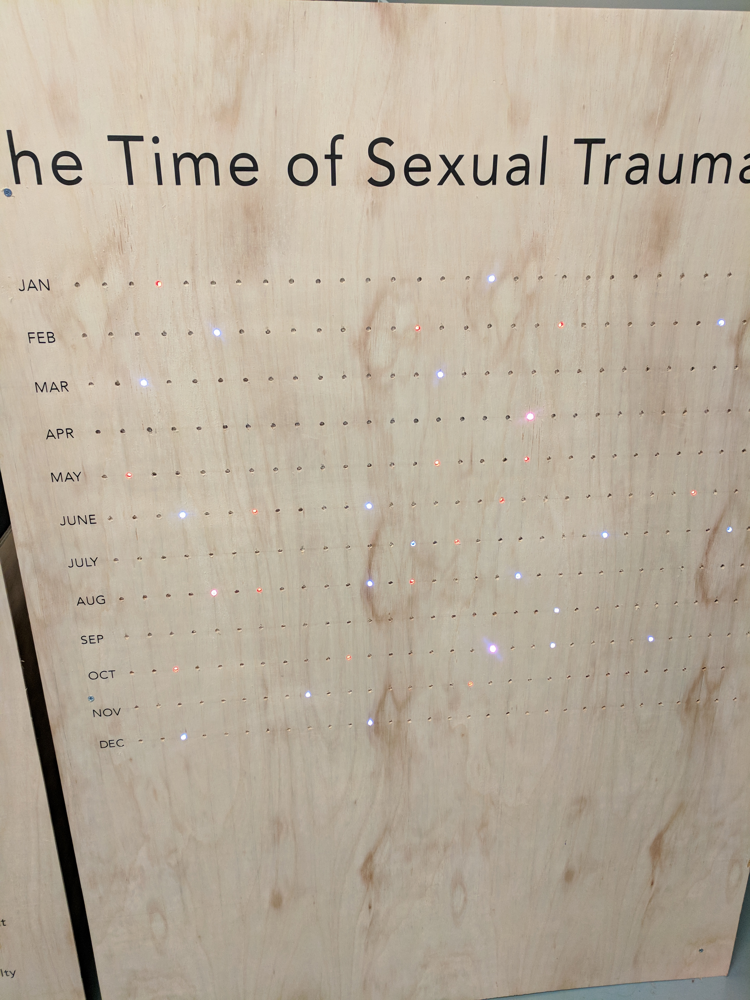

## NYC Open Data Week

#### NYC Open Data Week @ NYU

During the NYC Open Data Week, I attended an event hosted by [BUGS Open Source Club](https://bugs-nyu.github.io/open-data/open_data_week.html) that showcased student projects that incorporated open data.  

And here's me at the event:    

Initially, there was a talk involving a panel of people who are really involved in open data, and it included:  
  * __Dinorah Cantu-Pedraza__ - The GovLab Academy Coordinator The GovLab Profile
  * __Vicky Steeves__ - Librarian for Research Data Management and Reproducibility
  * __Dominic Mauro__ - Assistant General Counsel, NYC Department of Information technology & Telecommunications, Open Data Team
  
  In short, they discussed about their thoughts on open data, such as what is open data, their experiences with open data, why they are an advocate of open data, alternatives to open data, the unfortunate downsides of open data, and more.  
    
  One memorable quote said by Vicky Steeves (I think?) was that open data is a dataset that is __well documented__ and free to use. The key part that I mentioned here was the documentation part. There was a time where I came across a dataset that had zero data dictionary / metadata for me to cross-reference and I had to discard it because I did not know how to use it, and that felt wasteful.    
  
  Following the hour-long panel discussion is the showcase of student projects. There was one that I was particularly interested in, which was the __Predictive Model for Bitcoin Price using Natural Language Processing (and Bitcoin Historical Open Data)__. I wasn't sure how NLP factored into the predictive model, and I wanted to know how accurate that chart is. Other than that, the projects that were present at the event were interesting and very informative. For example, one project analyzed the Fire Incident Dispatch Data to output the response times in different areas and the efficient positions for future fire stations. 
  
  Overall, this event has been educational as I have learned more about open data. 
  
#### Data Through Design: Art Exhibit
  
  The second event that I attended was the __Data Through Design__ art exhibited located at 30 John St, Brooklyn. The mission of this event was to encourage a wider knowledge of NYC's open datasets.  
  
  And here's me:
    
  
  The exhibit was really small, and weirdly enough, half of the projects were not functioning correctly. 
  
  Some of the functional ones, however, were helpful in providing a better understanding of life in NYC.
  
##### Sexual Trauma
  
  For example, one of the exhibit was about Sexual Trauma, and it displays the type/count of sexual violence data onto minimalistic wooden year chart. 
  
  . 
  
  I captured this image that shows *all* the sexual violence in a year. The different colors and brightness of LED lights signifies how often a sexual violence is committed and  type of said sexual violence, respectively. Unfortunately, I wasn't able to find a key that tells me which color represents what sexual violent act, but the point was really clear. One thing I do wonder about is how they handled the days in which multiple sexual acts are committed. 
  
##### Patterns of Broken Windows Policing
  
  Another of the exhibited showcased all the violations that occurred in every single precinct. 
  
  Here's the data chart of the area I'm living in:  
  
  
  
##### Slow Down
   
   This particular exhibit displays all the traffic accidents in NYC, with each panel representing different years. In doing so, it brought awareness to traffic accidents in hopes of reducing the occurrence of said accidents. 
   
   Here's what it looks like:
   
   
     
   Overall, it was a fun event.
 